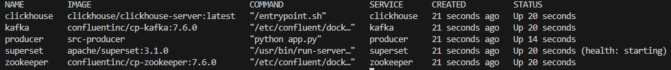
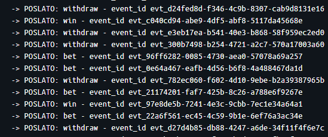
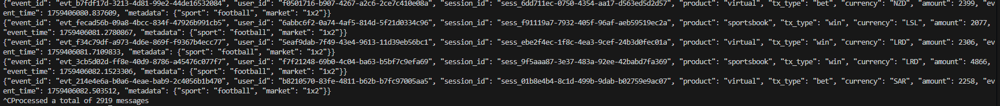

# Dnevnik Rada - Postavljanje KCS Stack-a (Kafka, ClickHouse, Superset)
## 🎯 Fokus Dana
Podizanje lokalnog ekosistema za analitiku transakcija i verifikacija konektivnosti svih ključnih servisa (ZooKeeper, Kafka, ClickHouse, Superset, Producent).

## 🛠 Izvršeni Zadaci
1. Inicijalno postavljanje docker-compose.yml fajla

Kreiran docker-compose.yml fajl sa pet servisa: zookeeper, kafka, clickhouse, superset i producer.
Mapirani portovi za hosta su: 9092 (Kafka), 2181 (ZooKeeper), 8123/9000 (ClickHouse), i 8088 (Superset).


2. Verifikacija Servisa
Svi servisi su provereni i verifikovana je njihova dostupnost i funkcionalnost.

### Status kontejnera
Nakon pokretanja svih servisa, provera komandom docker compose ps pokazala je sledeće:



### Provera konekcije i portova
#### Kafka (9092):

Ulazak u Bash shell kontejnera i listanje topica:

```bash
docker exec -it kafka bash
kafka-topics --bootstrap-server kafka:29092 --list
```
Veza je uspostavljena, tema transaction_events je automatski kreirana od strane producer-a, što potvrđuje da Kafka radi.

#### ClickHouse (8123/9000):
HTTP interfejs je dostupan na http://localhost:8123.
Port sluša, spreman za Superset konekciju.

#### Superset (8088):
Superset login stranica je dostupna na http://localhost:8088.


3. Kreiranje i pokretanje Producer-a

Kreirani fajlovi producer/Dockerfile i producer/app.py za simulaciju transakcija.
Producer servis je uspešno pokrenut, omogućena je konekcija sa kafka brokerom i definisana je fukncija za generisanje random podataka vezanih za transakciju. Simulirano je slanje poruka na topic transaction_events.

4. Provera poruka 
Logovi producer servisa koji potvrdjuju slanje poruka:



Ulazak u bash shell kafka kontejnera i provera poruka:
```bash
docker exec -it kafka bash
kafka-console-consumer --bootstrap-server kafka:29092 --topic transaction_events --from-beginning
```

