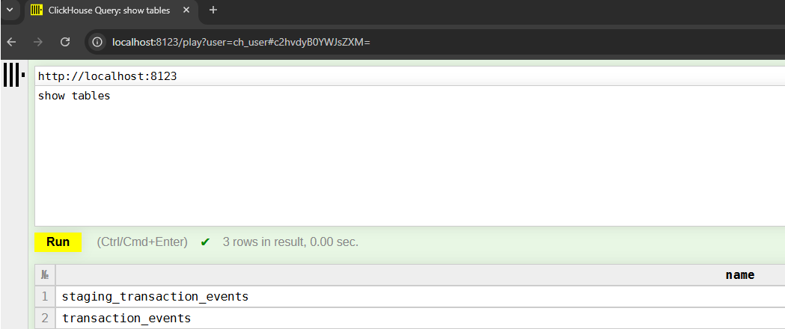
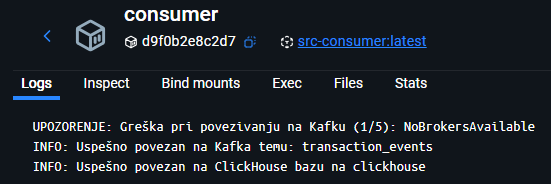

# Dnevnik Rada 
## 🎯 Fokus Dana 
Kreieanje Clickhouse tabela i uspostavljanje Python Consumer servisa za batch unos podataka u ClickHouse.


## 🛠 Izvršeni Zadaci
### 1. Dodavanje particija za topic *transaction_events*

```bash
docker exec -it kafka bash
kafka-topics --bootstrap-server kafka:29092 --topic transaction_events --alter --partitions 4
kafka-topics --bootstrap-server kafka:29092 --topic transaction_events --describe
```


### 2. Promena particionog ključa

Postavljeno je da partition key bude user_id iz 2 razloga: kako bi redosled transakcija korisnika bio zagarantovan i da bi particioni ključ bio visoko kardinalan. Event_id takodje omogućava distribuciju opterećenja, ali ne garantuje pravi redosled transakcija korisnika. (Pr. za nekog korisnika treba prvo da bude obradjen deposit pa bet, a ako su na razčicitim particijama može da dodje do greške.)

### 3. Clickhouse schema staging

Pomoću skripte *schema.sql* kreirane su staging i target tabele koje se vide nakon slanja upita preko ClickHouse HTTTP interface-a.


Kreiran je consumer servis koji se povezuje na Kafku-u i koji treba da vrši batch upis u ClickHouse *transaction_events* tabelu.
U okviru logova consumer servisa vidi se da je ostvarena konekcija sa kafka brokerom i bazom.


