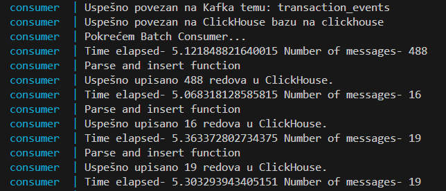

# Dnevnik Rada 
## 🎯 Fokus Dana 
Omogućen upis poruka na 2 načina, pomoću Python consumer servisa i koristeći ClickHouse Materialized View (MV). Potvrda end-to-end toka podataka (Kafka → MV → Tabela). Uvođenje osnovnih transformacija i pravila kvaliteta podataka.

## 🛠 Izvršeni Zadaci
### 1. Batch upis 

Pomoću consumer servisa omogućen je batch upis pročitanih poruka sa kafke u *transaction_events* tabelu.

Pristupanjem Web SQL UI za ClickHouse (http://localhost:8123/, potrebno je uneti username i password - definisani u docker-compose fajlu) i pokretanje komande za prikaz svih redova potvrđen je upis.

### 2. Upis pomoću Kafka engine-a and Materialized views

Promenjen je kafka_format u *JSONAsString* kako bi u *staging_transaction_events* tabeli bila zapamćena cela JSON poruka kao string, radi otpornosti na eventualnu promenu šeme. Za izdvajanje i konvertovanje podataka zadužen je *transaction_events_mv* materialized view, kojim se vrši unos u *transaction_events* tabelu. Upis je potvrđen na isti način kao u prethodnom koraku.

### 3. Osnovne transformacije i prvera kvaliteta podataka
