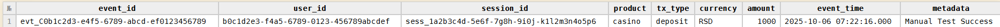
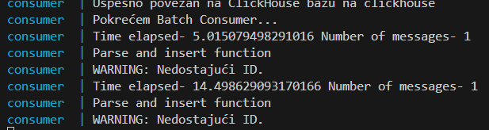
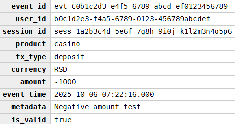
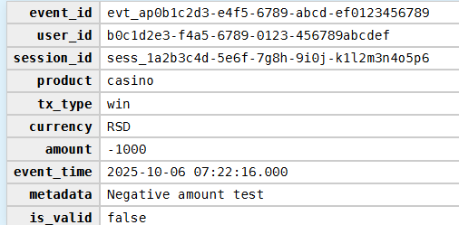
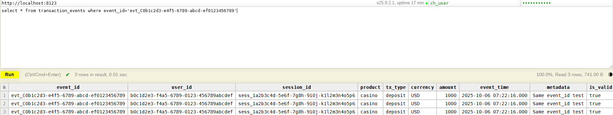
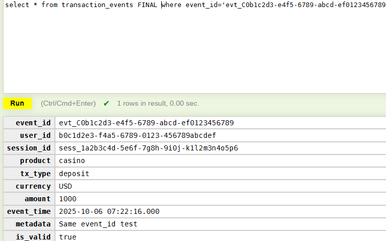

# Dnevnik Rada 
## 🎯 Fokus Dana 
Omogućen upis poruka na 2 načina, pomoću Python consumer servisa i koristeći ClickHouse Materialized View (MV). Potvrda end-to-end toka podataka (Kafka → MV → Tabela). Uvođenje osnovnih transformacija i pravila kvaliteta podataka.

## 🛠 Izvršeni Zadaci
### 1. Batch upis 

Pomoću consumer servisa omogućen je batch upis pročitanih poruka sa kafke u *transaction_events* tabelu.


Pristupanjem Web SQL UI za ClickHouse (http://localhost:8123/, potrebno je uneti username i password - definisani u docker-compose fajlu) i pokretanje komande za prikaz svih redova potvrđen je upis.


### 2. Upis pomoću Kafka engine-a and Materialized views

Promenjen je kafka_format u *JSONAsString* kako bi u *staging_transaction_events* tabeli bila zapamćena cela JSON poruka kao string, radi otpornosti na eventualnu promenu šeme. Za izdvajanje i konvertovanje podataka zadužen je *transaction_events_mv* materialized view, kojim se vrši unos u *transaction_events* tabelu. Upis je potvrđen na isti način kao u prethodnom koraku.

### 3. Osnovne transformacije i provera kvaliteta podataka
 Za potrebe testiranja isključeno je slanje poruka preko producer-a kako bi mogao da se isprati tok poruka. Ručno su napravljene poruke koje su poslate direktno kroz kafka container. 
 Komande za slanje poruka.
 ``` bash
 docker exec -it kafka bash
 kafka-console-producer --bootstrap-server kafka:29092 --topic transaction_events
 ```

#### Provera validacije valuta
Poslata je sledeća poruka sa nevažećom valutom.
```json
{"event_id": "evt_C0b1c2d3-e4f5-6789-abcd-ef0123456789", "user_id": "b0c1d2e3-f4a5-6789-0123-456789abcdef", "session_id": "sess_1a2b3c4d-5e6f-7g8h-9i0j-k1l2m3n4o5p6", "product": "casino", "tx_type": "deposit", "currency": "ABC", "amount": 1000, "event_time": 1759735336, "metadata": "Manual Test Success"}
```
Sistem je izvršio proveru i valuta je zamenjena default vrednošću ('RSD').


#### Provera integriteta ključeva
Posalata su poruke sa nedostajućim vrednostima *event_id* i *user_id*. Provera je prošla i nije dozvoljen upis u bazu.


#### Provera transakcija sa negativnim iznosom
U *transaction_events* tabelu dodata je kolona koja označava da li je transakcija važeća ili ne. Poslata je sledeća poruka sa negativnim iznosom.
```json
{"event_id": "evt_C0b1c2d3-e4f5-6789-abcd-ef0123456789", "user_id": "b0c1d2e3-f4a5-6789-0123-456789abcdef", "session_id": "sess_1a2b3c4d-5e6f-7g8h-9i0j-k1l2m3n4o5p6", "product": "casino", "tx_type": "deposit", "currency": "ABC", "amount": -1000, "event_time": 1759735336, "metadata": "Negative amount test"}
```
Sistem je izvršio proveru i označio transakciju kao važeću jer je u pitanju transakcija tipa *deposit*.


Poruka sa negativnom vrednošću *amount* koja je tipa *withdraw* je takodje transakcija koja se označava kao važeća.


Poslata je sledeća poruka sa negativnim iznosom.
```json
{"event_id": "evt_ap0b1c2d3-e4f5-6789-abcd-ef0123456789", "user_id": "b0c1d2e3-f4a5-6789-0123-456789abcdef", "session_id": "sess_1a2b3c4d-5e6f-7g8h-9i0j-k1l2m3n4o5p6", "product": "casino", "tx_type": "win", "currency": "ABC", "amount": -1000, "event_time": 1759735336, "metadata": "Negative amount test"}
```
Sistem je izvršio proveru i označio transakciju kao nevažeću jer je u pitanju transakcija tipa *win*. 


Poruka sa negativnom vrednošću *amount* koja je tipa *bet* je takodjetransakcija koja se označava kao nevažeća.


#### Testiranje idempotentnosti inserta
Sledeća poruka je poslata 3 puta kako bi se simuliralo slanje transakcije sa istim *event_id*-om. 
```json
{"event_id": "evt_C0b1c2d3-e4f5-6789-abcd-ef0123456789", "user_id": "b0c1d2e3-f4a5-6789-0123-456789abcdef", "session_id": "sess_1a2b3c4d-5e6f-7g8h-9i0j-k1l2m3n4o5p6", "product": "casino", "tx_type": "deposit", "currency": "USD", "amount": 1000, "event_time": 1759735336, "metadata": "Same event_id test"}
```
Na osnovu sledećeg upita može se videti da je u tabeli transakcija zabeležena 3 puta.


Nakon korišćenja upita sa ključnom reći FINAL u tabeli se nalazi samo jedan red zbog prinuđenog merge-a nakon čega je izvršena deduplikacija koja je definisana izborom ReplacingMergeTree engine-a.



