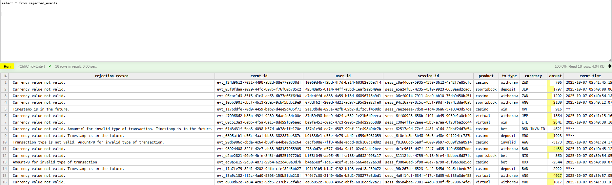
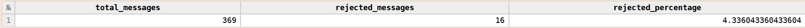

# Dnevnik Rada 
## 🎯 Fokus Dana 
Uvodjenje DQ metrickih vrednosti i implementacija logovanja gresaka.

## 🛠 Izvršeni Zadaci
### 1. Odredjivanje broja poruka po minutu
ClickHouse automatski evidentira sve izvršene upite u sistemskoj tabeli pod nazivom system.query_log. Ova tabela sadrži meta-podatke o svakoj operaciji koja se desila na serveru. Koristeći filtere za tip upita, status upita i tabelu kreiran je query koji vraća koliko je transakcija upisano u tabelu *transaction_events* u prethodnom minutu.

```sql
SELECT
    count() AS ingested_rows
FROM
    system.query_log
WHERE
    query_kind = 'Insert'
    AND type = 'QueryFinish'
    AND query ILIKE '%INSERT INTO transaction_events%' 
    AND event_time > (now() - INTERVAL 1 MINUTE);
```
### 2. Generisanje nevažećih poruka
U okviru producer servisa implementirana je nova funkcija *generate_bad_data()* kako bi se testiralo funkcionisanje registrovanja poruka sa nevažećim transakcijama u okviru consumer servisu.

### 3. Obradjivanje odbijenih poruka
Izmenjeno je da se transakcije sa nevažećom vrednošću valute odbijaju. Uvedena je provera tipa transakcije i provera timestampa da nije u budućnosti.

Dodato je logovanja za svaku odbijenu poruku u consumer servisu. 

Kreirana je tabela rejected_events kako bi se pratile poruke koje su nevažeće kako i razlog njihovog odbijanja. U tabeli *transaction_events* se više ne pamte nevalidne transakcije tako da je izbačena kolona *is_valid*.

Pregled tabele *rejected_events*.


Upit koji odredjuje procenat odbijenih poruka u datom trenutku.
``` sql 
WITH
    (
        SELECT count()
        FROM transaction_events
    ) AS valid_count,
    (
        SELECT count()
        FROM rejected_events
    ) AS rejected_count
    
SELECT
    valid_count + rejected_count AS total_messages,
    rejected_count AS rejected_messages,
    (rejected_count / total_messages) * 100 AS rejected_percentage
```


Upit koji odredjuje lag_time za transakcije.
```sql
SELECT event_id, ingestion_time-event_time AS lag_time 
FROM transaction_events
```

Upit koji računa prosečno i maksimalno kašnjenje.
```sql 
SELECT avg(ingestion_time-event_time) AS avg_lag_time, 
       max(ingestion_time-event_time) AS max_lag_time
FROM transaction_events
```


