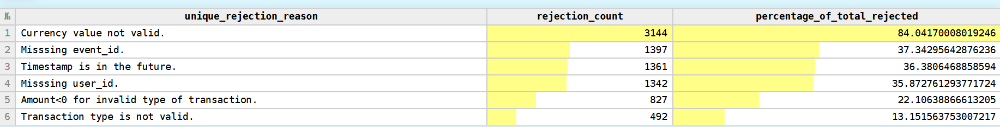

# Dnevnik Rada 
## 🎯 Fokus Dana 

## 🛠 Izvršeni Zadaci
### 1. Dodatno proučavanje ReplacingMergeTree Engine-a
Replacing radi po principu deduplikacije na osnovu sorting key-a. Pamte se sve verzije sa istiom vrednošću sorting key-a sve dok se ne desi merge(background proces konsolidacije parts-a). Merge operacije su asinhrone i dešavaju se u nepoznatom vremenu za korisnika koje odlučuje ClickHouse.

### 2. Tokenizacija polja u *rejected_events* tabeli
Polje *rejection_reason* predstavlja skup razloga zašto je neka transakcija odbačena. Kako bi kasnije bila omogućena analitka po odredjenom razlogu odbacivanja, potrebno je obezbediti brzu obradu ovog text-based polja. U ClickHouse-u text search zahteva full scan polja osim ako se ne iskoristi neka tehnika za ubrzavanje. 

#### Pamćenje razloga odbijanja u okviru polja tipa Array(String)
Prednost se ogleda u tome što se za pretragu reda po odredjenom razlogu koriste visoko optimizovane funckije za rad sa nizovima.
Dodato polje u *rejection_events* tabelu *rej_reasons*.

- Test 1: Pronalazak broja transakcija koje su odbačene iz razloga definisanog upitom.
```sql
SELECT count()
FROM rejected_events
WHERE has(rej_reasons,'Currency value not valid.')
```
- Test 2: Odredjivanje procentualne zastupljenosti odredjenog razloga odbijanja.
```sql
WITH(
        SELECT count()
        FROM rejected_events
    ) AS total_rejected_events
SELECT 
    arrayJoin(rej_reasons) AS unique_rejection_reason, 
    count() AS rejection_count,
    toFloat64(rejection_count) / total_rejected_events * 100 AS percentage_of_total_rejected
    
FROM rejected_events
GROUP BY unique_rejection_reason
ORDER BY rejection_count DESC;
```


#### Dodavanje inverted index-a
Invertovani indeksi mapiraju svaki token kolone na redove koji sadrže taj token. 
Dodat je indeks *rej_res_tokenized* u tabelu *rejection_events*.


