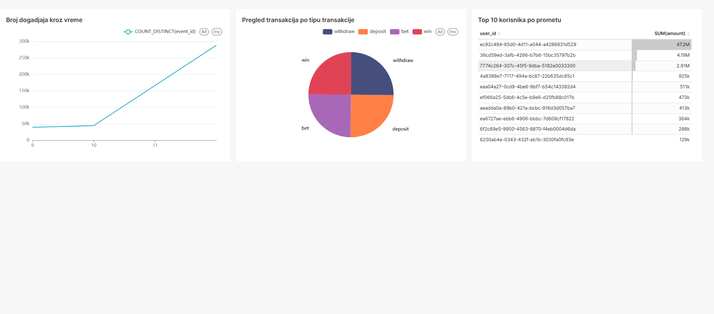

# Dnevnik Rada 
## 🎯 Fokus Dana 
Kreiranje dashboard-a u SuperSet-u. Kreiranje piechart, linechart i barchart grafikona.

## 🛠 Izvršeni Zadaci
### 1. Kreiranje dashboard-a koji se tiče biznis podataka
 

### 2. Kreiranje dashboard-a koji se tiče operacionih podataka

### 3. Ispravke u *consumer* servisu

Dodata je provera ukoliko nedostaje *session-id* i provera tipa *product* koja je nedostajala.

### 4. Ispravka prilikom ubacivanja u hourly_metrics i daily_metrics
Kada *event_time* nedostaje za neku transakciju ona se tretira kao odbijena i potrbeno je upisati u *daily_metrics* i *hourly_metrics*. Zamenjeno je da se u *rejected_hourly_mv* i *rejected_daily_mv* koristi *ingestion_time* kako ne bi dolazilo do greške prilikom upisa.

### 5. Ispravka u *producer* servisu
Slanje transakcija tipa *win*  sa manjo verovatnoćom kako bi se realnije simulirali podaci.