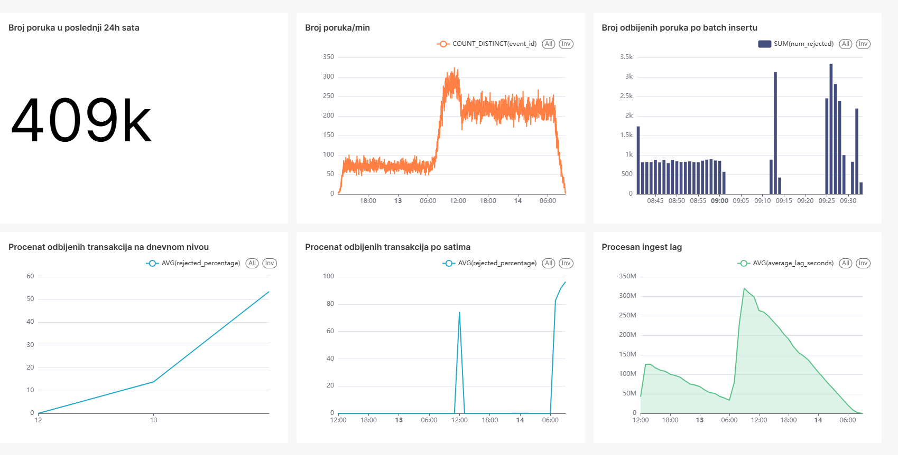
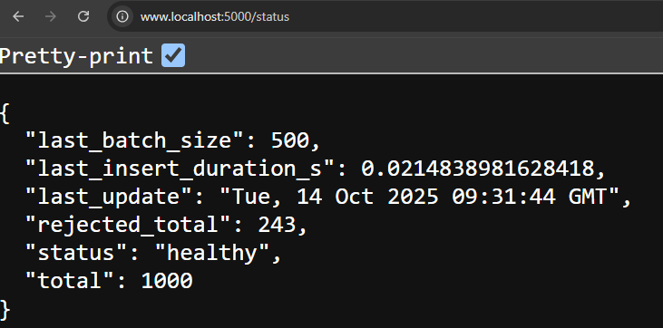

# Dnevnik Rada 

## 🛠 Izvršeni Zadaci
### 1. Beleženje neuspelih inserta u posebnu *pipeline_metrics* tabelu
Kreirana je tabela *pipeline_metrics* koja pamti broj transakcija koje nisu uspele da se upišu u bazu i broj odbijenih poruka po batch-u.

### 2. Dodavanje log poruka
Dodate log poruke sa vremenom trajanja batch inserta i brojem redova u batch-u.

### 3. Monitoring pipeline metrike
Kreiran je dashboard u Supersetu koji ima sledeće grafikone.

### 4. Health check endpoint
Pokrenuti consumer servis i kao Flask aplikaciju. Definisan je */status* endpoint koji vraća informacije o poslednjoj veličini batch-a, poslednjem trajanju unosa batch-a u bazu, ukupan broj odbijenih poruka

### 5. Simulacija još većeg opterećenja
Povećanje batch_size na 1000 i commit intervala na 0.01. Sleep interval kod *producer* servisa samnjen na 0.01. 
Povećanje batch_size na 10000.

