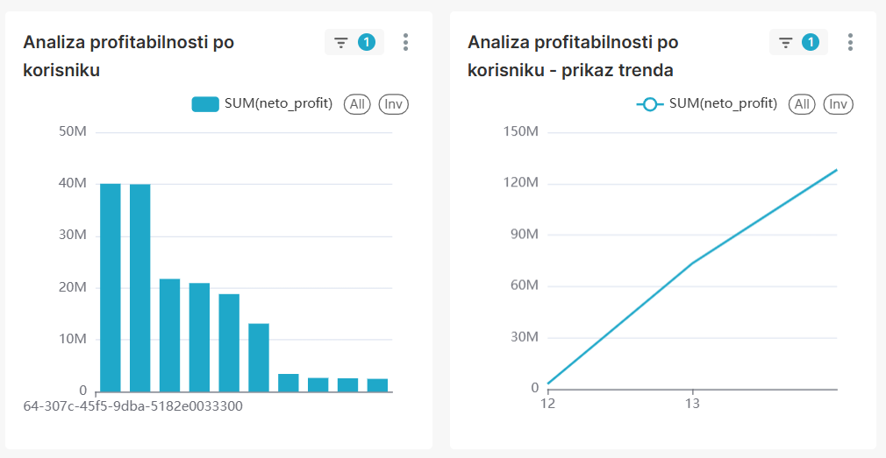
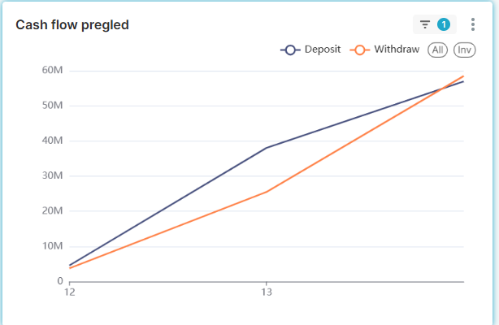
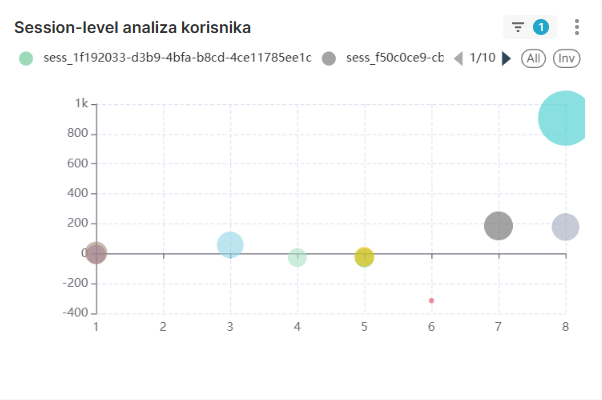
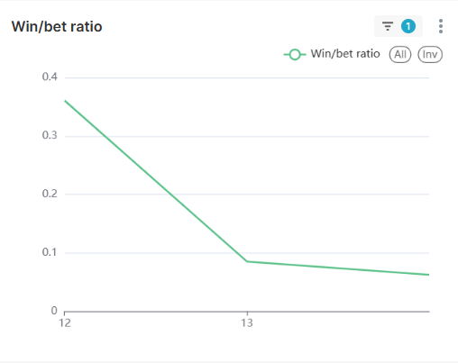

# Dnevnik Rada 
## 🎯 Fokus Dana 
Kreiranje dashboard-a u SuperSet-u. Proba kreiranja Spark aplikacije za Ml.

## 🛠 Izvršeni Zadaci
### 1. Proba kreiranja Spark aplikacije za Ml

https://github.com/anjatonsa-ds/test_ml_ksc

- Kreiran je PySpark skript (*transaction_mlib.py*) sa svrhom simulacije podataka o transakcijama. Podaci su hardkodovani za testiranje, uključujući jedan zapis sa izuzetno visokim iznosom koji simulira anomaliju za *amount*.
- Testirano je da li Spark ispravno učitava i obrađuje podatke koristeći ključne MLlib transformacije.
- Kategoričke kolone (kao što su product i tx_type) su uspešno konvertovane u numeričke indekse (npr. product_index) koristeći StringIndexer.
- Kreirana je finalna kolona features spajanjem svih numeričkih kolona (amount i novokreiranih indeksa) u jedan vektor koristeći 
VectorAssembler. Ovaj vektor predstavlja standardni ulazni format za sve MLlib modele.

### 2. Kreranje novog Bussnies dashboard-a

- Zadatak 1: Analiza profitabilnosti po korisniku

- Zadatak 2: Cash flow pregled

-Zadatak 3: Session-level analiza korisnika

-Zadatak 4: Win/Bet ration trend

-Zadatak 5: Retention & engagement analiza

-Zadatak 6: Suspicious Activity / Anomaly Detection

