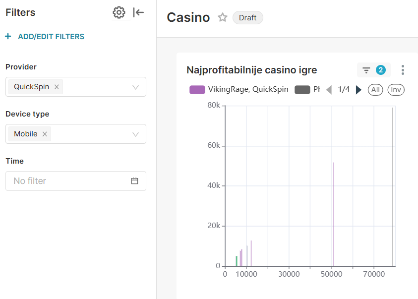
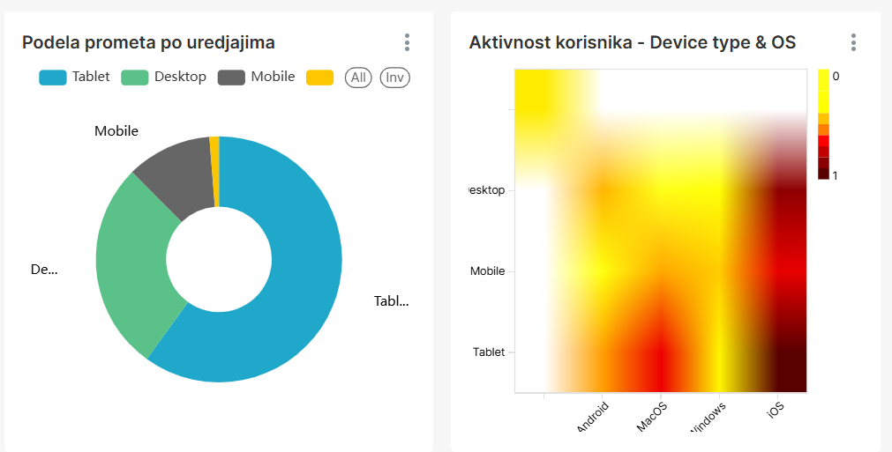
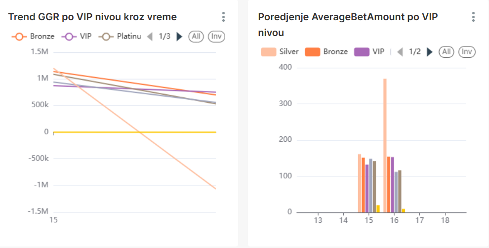

# Dnevnik Rada 
## 🎯 Fokus Dana 
Kreiranje dashboard-a u SuperSet-u. Promena funkcije za generisanje podataka.

## 🛠 Izvršeni Zadaci
### 1. Promena funkcije za generisanje podataka
Za transakcije gde je *product* tipa 'casino' napravljena je posebna funkcija koja ce da generise podatake za transakciju, ali sa metapodacima koji sadrze sledeća polja: "CasinoGame", "CasinoProvider","GameCategory", "GameTheme", "GameRTP", "BonusFeatureTriggered", "FreeSpinsCount", "JackpotHit", "SessionDurationSec", "DeviceType", "OS", "Browser", "Language", "Country", "VIPLevel", "PromoCodeUsed", "PaymentMethod", "DepositChannel", "GameMode", "ConnectionType".

Kako bi prethodni izveštaji ostali nepromenjeni, napravljena je nova tabela *casino_transactions* koja će biti korišćena za generisanje izveštaja u nastavku.

### 2. Dopuna novog Bussnies dashboard-a

- Zadatak 1: Najprofitabilnije casino igre.

- Zadatak 2: Aktivnost korisnika po uredjajima.

- Zadatak 3: VIP segment analiza.
