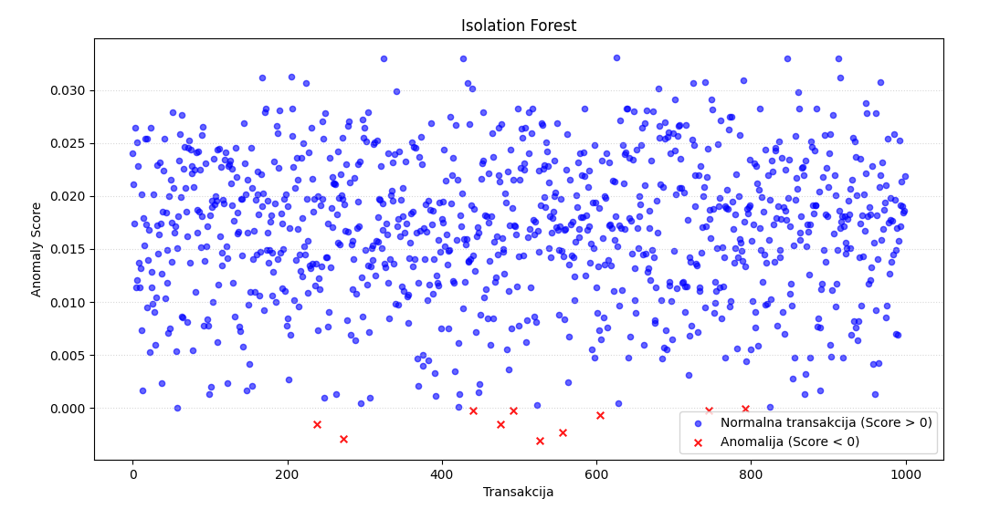

# Dnevnik Rada 
## 🎯 Fokus Dana 
AI Mini projekat - Anomaly detection

## 🛠 Izvršeni Zadaci
### 1. Priprema trening podataka

Za izvlačenje 1000 random transakcija iz tabele *transaction_events*  koristi se sledeći upit koji se pokreće u terminlau *clickhouse-client*-a

```bash
docker exec -it clickhouse bash
clickhouse-client --query "SELECT amount, toHour(event_time) as hour_of_day, currency, reinterpretAsUInt128(replaceRegexpAll(user_id, '-', '')) % 10 AS user_id_mod FROM transaction_events WHERE rand()%10+0 LIMIT 1000;" > random_transactions.csv
exit
docker cp clickhouse:/random_transactions.csv ./ai-model
```

### 2. Upoznavanje sa mašinskim učenjem
Literatura:http://ri4es.etf.rs/materijali/vezbe/IS_Masinsko_ucenje.pdf

### 3. IsolationForest algoritam

- IsolationForest algoritam - pripada grupi nenadgledanih algoritama mašinskog učenja i služi za identifikaciju anomalija. Anomalije detektuje tako što ih izoluje u procesu random particionisanja kolekcije stabala odlučivanja.
IsolationForest algoritam je baziran na stablima (sličan RandomForest algoritmu), koristi IsolationTrees.

Koraci u algoritmu:
1) U koren se smeštaju sve ili deo instanci.
2) Selektuje se random karakteristika.
3) Random se slektuje vrednost podele koja se nalazi u opsegu za selktovanu karakteristiku.
4) Podaci se dele u 2 čvora na osnovu vrednosti podele.
5) Proces se ponavlja rekurzivno za svaki child čvor dok se ne ispuni jedan od 2 uslova: Svaki list ima samo jednu instancu. Predefinisana dubina stabla je dostignuta.

Parametri koji se koriste za treniranje IsolationForest su: 
    -n_estimators(eksperimentalno je dokazano da vrednost od 100 daje dobre rezultate), 
    -contamination(procenat podataka za koji se pretpostavlja da će biti anomalije), 
    -sample_size(broj instanci koji se koristi za treniranje svakog IsolationTree, obično se koristi 256). 

Prednosti IsolationForest algoritma: 
1) može da se koristi za visoko-dimenzionalne podatke - instance mogu da budu označe kao anomalioje na osnovu korišćenja svih atributa, pritom mogu se detktovati anomalije različitih vrsta
2) ima linearnu vremensku složenost
3) ne zahteva prethodno znanje o skupu podataka kako bi mogao da odredi anomalije

Ograničenja IsolationForest algoritma:
1) performanse mogu biti loše sa malim skupovima podataka
2) identifikuje potencijalne anomalije, ali ne daje objašnjenje zašto su anomalije


### 4. Primena IsolationForest algoritma
Kod se nalazi u *ai-model\app.py*.
Prikaz detektovanih anomalija na ulaznom skupu podataka.


Model je sačuvan u *model.pkl* fajlu.
