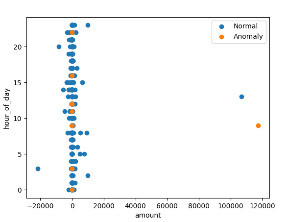
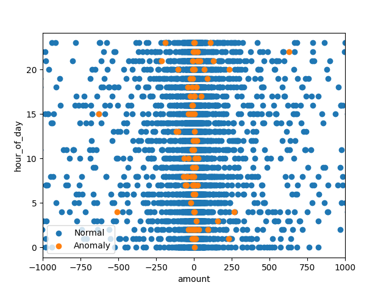
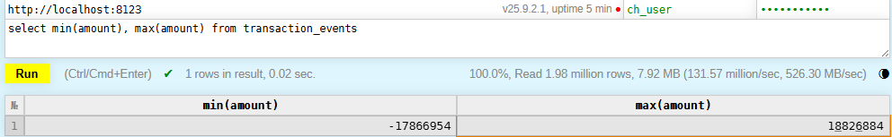

# Dnevnik Rada 
## 🎯 Fokus Dana 
AI Mini projekat - Anomaly detection

## 🛠 Izvršeni Zadaci
### 1. Integracija modela u Python consumer
Model je učitan u *consumer* servisu. Prilikom čitanja svake poruke, model se poziva i odredjuje se vrednost novog polja *anomaly_score* koje označava da li je transakcija označena kao sumnjiva.

### 2. Dodavanje kolone u ClickHouse tabeli
Za testiranje je kreirana nova tabela *transaction_events_anomaly* koja ima istu šemu kao i *transaction_events* tabela i dodatnu kolonu *anomaly_score*.

### 3. Plotovanje normal i anomaly vrednosti
Na osnovu rezultata koji se dobijaju nad trening podacima, napravljen je grafik koji predstavlja vrednosti *amount* i *hour* za normalne vrednosti i vrednosti koje su označene kao anomalije. 

Na osnovu ovog grafika ne može da se zaključi koje bi vrednosti trebalo da se iskoriste za testiranje sa veštačkim anomalijama. Pretpostavka - trening skup je previše mali.

Model je istreniran sa 10000 nasumičnih transakcija.

Na osnovu ovog grafika nije najintuitivnije odrediti zašto se za anomalije označavaju vrednosti bliske nuli za *amount* za bilo koje doba dana.

### 4. Testiranje sa veštačkim anomalijama
Pronadjene su maksimalna i minimalna vrednost *amount* polja u *transaction_events* tabeli kako bi bila poslata neka mnogo manja i neka mnogo manja veća vrednost.
18 826 884 

Poslata je transakcija sa *amount*=50000000.05. Nije označena kao anomalija.

