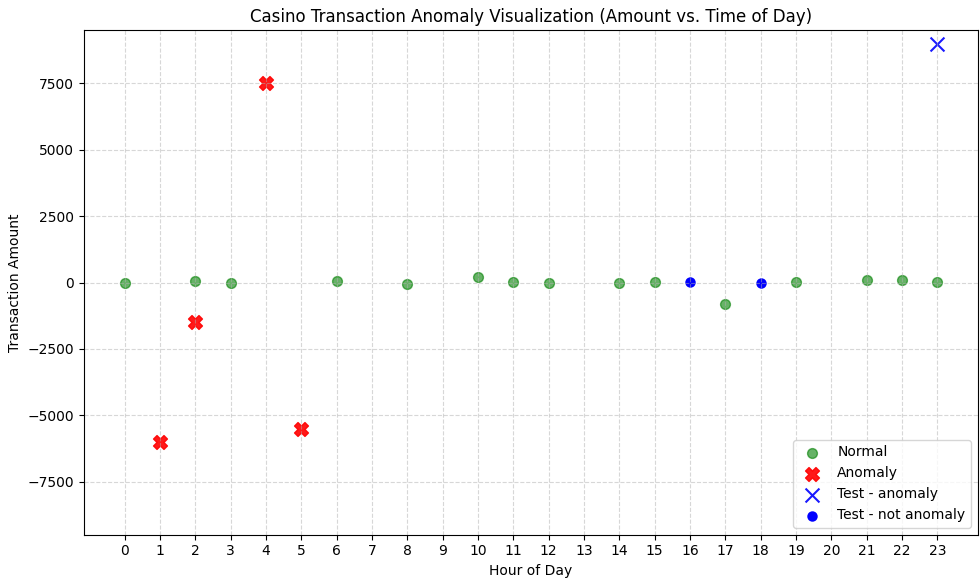

# Dnevnik Rada 
## 🎯 Fokus Dana 
AI Mini projekat - Anomaly detection - Promena algoritma

## 🛠 Izvršeni Zadaci
### 1. Priprema trening dataset-a

Kreiran je skup podataka koji ima 15 normalnih transakcija i i par velikih transakcija za svaki tip transakcije, ali u toku časova kada je minimalna aktivnost.

### 2. Feature engineering

Pripremljeni su feature-i za model:

Ciklično kodiranje ('hour_of_day') pomoću sinusa i kosinusa za bolji prikaz ciklusa vremena, kako se ne bi tumačio linearno 0-23 kao sto se amount tumači linearno. Kreiran je feature apsolutne vrednosti ('abs_amount'). Kategoričke varijable ('tx_type', 'currency') su kodirane pomoći One-Hot Encoder-a. Implementiran StandardScaler za skaliranje numeričkih feature-a.

### 3. Treniranje modela i validacija

Iskorišćen je algoritam LogisticRegression.

Kreirana su 3 test slučaja od kojih jedan predstavlja veštački pripremljenu anomaliju odnosno vrednost transakcije koja je izuzetno velika za izabrano doba dana. Transakcije su vizuelizovane na grafiku i vidi se da su test podaci su dobro klasifikovani u klase.

### 4. Analiza Casino sekcije Analytics Dashboard-a
Sastanak sa Mladenom radi detaljnog upoznavanja sa AnalyticsDashboard aplikacijom.
- Sveobuhvatan pregled svih postojećih kontrolnih tabli, sa fokusom na funkcionalnost sekcije Casino.
- Detaljna analiza implementiranih filtera unutar aplikacije.
- Diskusija radi optimalnog modelovanja tabela za ClickHouse u cilju postizanja maksimalne brzine i efikasnosti traženih upita.