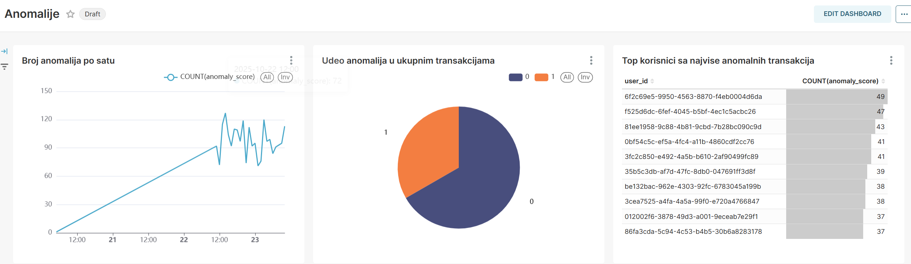

# Dnevnik Rada 
## 🎯 Fokus Dana 
AI Mini projekat - Anomaly detection - Testiranje novog algoritma

## 🛠 Izvršeni Zadaci
### 1. Pormena integracije modela u Python consumer
Zamenjen je model koji se učitava u *consumer* servisu. Prilikom čitanja svake poruke, model se poziva i odredjuje se vrednost novog polja *anomaly_score* koje označava da li je transakcija označena kao sumnjiva.

### 2. Testiranje sa veštačkim anomalijama
Poslata je transakcija sa *amount*=50000000.05 i vremenom u 3h ujutru. Uspešno je označena kao anomalija.

### 3. Kreiranje dashboard-a
U Supersetu je dodat novi izvor podataka - tabela sa anomalijama kako bi bili kreirani grafici koji prikazuju: broj anomalija po satu, udeo anomalija u ukupnim transakcijama, top korisnici sa najvise anomalnih transakcija.

Dashboard anomalija

